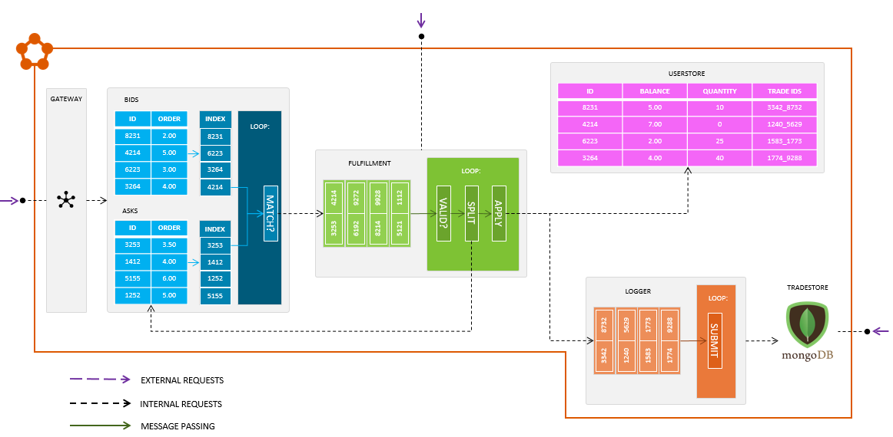

[

# Exchange

The Exchange application is a fabricated trading platform. It allows buyers and sellers to exchange values of currency between each other. The application has been designed and built around Service Fabric [Reliable Services](https://docs.microsoft.com/en-us/azure/service-fabric/service-fabric-reliable-services-introduction) and consists of 6 main components:

__OrderBook__

The OrderBook is the core order handling engine. It exposes an API that allows users to submit new bid orders and ask orders. The service is stateful and stores the bid orders and ask orders in OrderSets. OrderSets are a wrapper around [reliable dictionaries](https://docs.microsoft.com/en-us/azure/service-fabric/service-fabric-reliable-services-reliable-collections). They add some domain specific functionality such as keeping a ordered secondary index so that we know which order is the highest priority in each set. Each OrderSet has a bounded capacity, once this is reached the OrderBook will start to reject requests.
The OrderBook runs a continuous processing loop inside the RunAsync method that takes the highest priority order from each OrderSet and then compares them to see if they are a match. They will be considered a match if the ask order satisfies the bid order .i.e. the amount of currency being sold is sufficient.
Once and ask and a bid have been matched, they are bundled into a trade. A trade is then passed from the OrderBook service to the Fulfillment service for evaluation.

__Fulfillment__

The Fulfillment service is responsible for validating and executing trades passed to it from the OrderBook. It buffers trades in a TradeQueue. The TradeQueue is a wrapper around a reliable concurrent queue, meaning it is persistent but not strictly FIFO. The TradeQueue has a bounded capactity, once this is reached the Fulfillment service will start to reject requests.
The Fulfillment service runs a continuous processing loop inside the RunAsync method that pulls trades off the queue, validates them and then exchanges the currency values between the 2 involved users (buyer and seller).
The Fulfillment service also passes the trade off to the Logger service to handle.

__UserStore__

The UserStore is simply a single reliable dictionary that holds user data. It then exposes simple CRUD-like operations over its [Remoting v2 API](https://docs.microsoft.com/en-us/azure/service-fabric/service-fabric-reliable-services-communication-remoting#how-to-use-remoting-v2-stack). The UserStore is a singleton as updates to both users need to happen atomically to avoid half of a trade being applied.

__Logger__

The Logger service is responsible for the long term storage of trades. As trades are passed to the Logger it buffers them in an unbounded reliable queue. 
The Logger service runs a continuous processing loop inside the RunAsync method that pulls trades off the queue,
and pushes them into an external database. By default this is [MongoDB](https://www.mongodb.com/).

__TradeStore__

This is not actually a service, it is the database component that backs the logger. 
By default this is a single MongoDB instance.

__Gateway__

The Gateway service is an entrypoint for external load tests to run against. It has been designed specifically to allow load tests to handle both partitioned and non-partitioned services using the same URL. It also has deliberately high CPU usage to help facilitate the gamification of this event. Please do not modify or remove the gateway.

